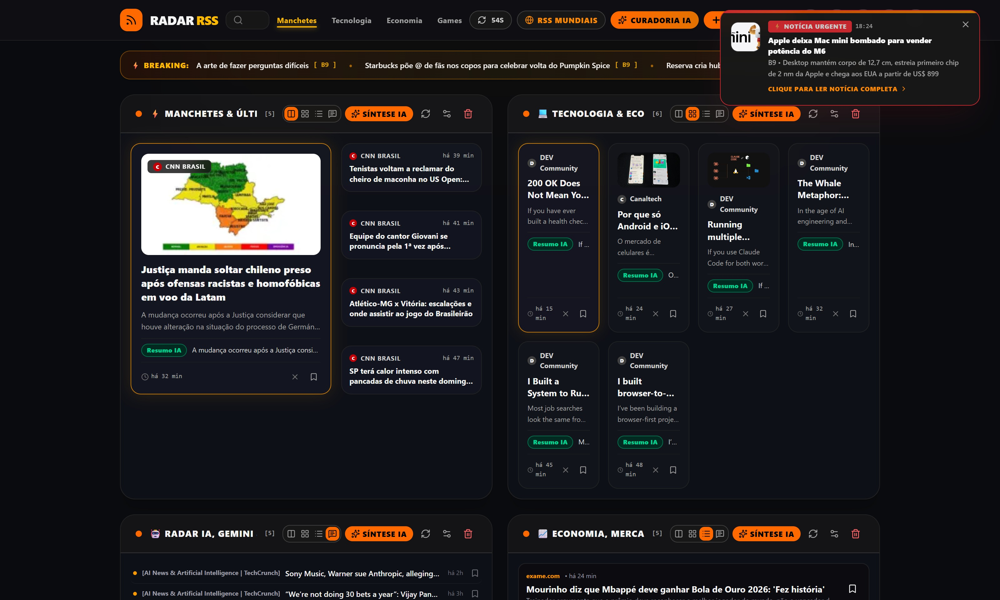

# 📡 Radar RSS

<div align="center">

[](https://github.com/dznass-cmd/RadarRSS/releases)
[](LICENSE)
[](https://react.dev)
[](https://www.typescriptlang.org)
[](https://www.electronjs.org)
[](https://github.com/dznass-cmd/RadarRSS/releases)
[](https://ai.google.dev)
[](https://tailwindcss.com)

<br />

**Agregador de notícias dinâmico e inteligente em tempo real com curadoria por Inteligência Artificial (Google Gemini), aplicativo desktop para Windows e aplicativo nativo para Android.**

[English](README.md) • **Português (Brasil)**

<br />

[📥 Baixar Aplicativo](#-download--instalação-windows--android) • [✨ Recursos](#-principais-recursos) • [🚀 Como Rodar](#-como-rodar-localmente) • [🤖 Configurar IA](#-configuração-de-ia-google-gemini) • [🔄 Atualizações](#-atualizações-automáticas)

<br /><br />

<p align="center">
  
</p>

</div>

---

## 📖 Sobre o Projeto

O **Radar RSS** monitora múltiplos portais de notícias em tempo real, organizando os feeds automaticamente por categorias inteligentes (como *Manchetes*, *Tecnologia*, *Economia*, *Mundo*, *Games*, entre outros).

Utilizando o poder dos modelos de **Inteligência Artificial do Google Gemini**, o Radar RSS sintetiza resumos rápidos, extrai insights essenciais, classifica sentimentos e destaca acontecimentos de última hora (*breaking news*), poupando tempo e eliminando ruídos informativos.

---

## ✨ Principais Recursos

- ⚡ **Feed em Tempo Real:** Agregação rápida de múltiplos feeds RSS (nacionais e internacionais) com atualização contínua e sem bloqueio.
- 🧩 **Agrupamento e Deduplicação Inteligente de Notícias (Story Clusters):**
  - Identifica e unifica a cobertura do mesmo fato reportado por múltiplos veículos (ex: Reuters, The Verge, TechCrunch) em uma única história organizada.
  - Motor de similaridade multi-sinal: sobreposição de tokens, n-grams, entidades nomeadas/números, proteção contra divergência de ação (evitando falsos positivos como "lança novo iPhone" vs "aumenta preço do iPhone"), decaimento temporal e URLs canônicas.
  - Badge visual de múltiplas fontes ("3 fontes"), gaveta expansível para comparar coberturas e alternador de fonte dentro do leitor.
  - Briefing executivo consolidado com Gemini sintetizando as diferentes perspectivas em um único resumo.
  - Estratégias configuráveis nas preferências (Equilibrado, Conservador, Agressivo) e janela de tempo customizável.
- 🧠 **Curadoria Inteligente com Google Gemini:**
  - Resumos automáticos em tópicos diretos e objetivos.
  - Análise contextual e detecção de urgência (*Breaking News*).
  - Tradução e sintetização instantânea de notícias internacionais.
- 🖼️ **Exibição Inteligente de Imagens (`SafeImage`):** Extração robusta de mídias incorporadas (`media:content`, `enclosure`, tags HTML), resolução de links relativos, bloqueio de pixels rastreadores e fallback visual elegante em caso de indisponibilidade.
- 🖥️ **Aplicativo Desktop Windows:** Janela nativa leve via Electron com atalhos, barra de título integrada e bandeja do sistema.
- 📱 **Aplicativo Nativo Android:** Experiência móvel completa via Capacitor, com suporte a gestos de toque, temas escuro/claro e síntese de voz (TTS).
- 🔄 **Atualizações Automáticas (Auto-Updater):** Atualização transparente em segundo plano através de GitHub Releases oficiais.
- 🎨 **Interface Moderna & Flexível:**
  - Tema escuro e claro com paletas de acentuação visual (âmbar, esmeralda, ciano, violeta, etc.).
  - Layouts de blocos customizáveis (grade, lista compacta, cartões destacados).
  - Modal de leitura focado (*Focus Mode*) para leitura sem distrações.

<br />

<p align="center">
  
</p>

---

## 📥 Download & Instalação (Windows & Android)

Você pode baixar a versão mais recente diretamente na seção de [Releases](https://github.com/dznass-cmd/RadarRSS/releases):

| Plataforma | Versão | Descrição | Link |
|---|---|---|:---:|
| 🪟 Windows | 💿 **Instalador Oficial** | Recomendado. Cria atalhos e **recebe atualizações automáticas** | [Baixar Setup (.exe)](https://github.com/dznass-cmd/RadarRSS/releases/latest) |
| 🪟 Windows | 💼 **Portátil** | Executável único. Roda diretamente sem necessidade de instalação | [Baixar Portátil (.exe)](https://github.com/dznass-cmd/RadarRSS/releases/latest) |
| 📱 Android | 📦 **APK Nativo** | Aplicativo nativo para smartphones e tablets Android | [Baixar APK (.apk)](https://github.com/dznass-cmd/RadarRSS/releases/latest) |

---

## 🚀 Como Rodar Localmente

### Pré-requisitos
* [Node.js](https://nodejs.org) (versão 18 ou superior)
* `npm` ou gerenciador de pacotes equivalente
* [Android Studio](https://developer.android.com/studio) (Opcional, apenas se for compilar o APK localmente)

### Passo a passo

1. **Clone o repositório:**
   ```bash
   git clone https://github.com/dznass-cmd/RadarRSS.git
   cd RadarRSS
   ```

2. **Instale as dependências:**
   ```bash
   npm install
   ```

3. **Configure a chave do Gemini (Opcional, para recursos de IA):**
   Crie um arquivo `.env.local` na raiz:
   ```env
   GEMINI_API_KEY=sua_chave_aqui
   ```

4. **Inicie o ambiente de desenvolvimento:**
   ```bash
   npm run dev
   ```
   Acesse a interface no navegador em `http://localhost:3000`.

5. **Para rodar em janela desktop (Electron em modo dev):**
   ```bash
   npm run desktop
   ```

6. **Para compilar e sincronizar com o Android (Capacitor):**
   ```bash
   npm run build:android
   npm run open:android
   ```

---

## 🤖 Configuração de IA (Google Gemini)

Os recursos de IA utilizam o SDK `@google/genai` do Google:

1. Obtenha uma chave de API gratuita no [Google AI Studio](https://aistudio.google.com/).
2. **Ambiente de Desenvolvimento:** adicione `GEMINI_API_KEY=sua_chave` no arquivo `.env.local`.
3. **Versão Desktop / Produção:** crie um arquivo `.env` no mesmo diretório do executável `Radar RSS.exe` contendo `GEMINI_API_KEY=sua_chave`.

> *Nota:* Sem a chave da API, todas as funções de leitura e agregação RSS continuam funcionando normalmente, com os resumos de IA desativados.

---

## 🛠️ Tecnologias Utilizadas

| Camada | Tecnologia |
|---|---|
| **Frontend** | [React 19](https://react.dev), [TypeScript](https://www.typescriptlang.org), [Vite](https://vitejs.dev), [Tailwind CSS 4](https://tailwindcss.com) |
| **Backend Local** | [Node.js](https://nodejs.org), [Express](https://expressjs.com), [rss-parser](https://www.npmjs.com/package/rss-parser) |
| **Inteligência Artificial** | [Google Gemini API](https://ai.google.dev) (`@google/genai`) |
| **Mobile** | [Capacitor](https://capacitorjs.com) (Android Nativo) |
| **Desktop & Empacotamento** | [Electron](https://www.electronjs.org), [electron-builder](https://www.electron.build) |
| **Auto-Update & CI/CD** | [electron-updater](https://www.electron.build/auto-update), [GitHub Actions](https://github.com/features/actions) |
| **Ícones & Animações** | [Lucide React](https://lucide.dev), [Motion](https://motion.dev) |

---

## 📦 Scripts Disponíveis

* `npm run dev` — Inicia o backend Express com Vite em modo hot-reload.
* `npm run build` — Compila a interface React e empacota o servidor de produção em `dist/`.
* `npm run desktop` — Compila e abre o app em janela nativa do Electron.
* `npm run build:win` — Gera os executáveis Windows (instalador + portátil) na pasta `release/`.
* `npm run build:android` — Compila o bundle web e sincroniza com o projeto Android.
* `npm run publish:win` — Compila e publica a release no GitHub via `electron-builder`.
* `npm run lint` — Valida a tipagem estática com TypeScript (`tsc --noEmit`).

---

## 🔄 Atualizações Automáticas

O instalador desktop do **Radar RSS** conta com verificação e download em segundo plano integrado via GitHub Releases:

1. Ao abrir o aplicativo, ele consulta a API do GitHub Releases.
2. Havendo uma nova versão disponível, o download ocorre em segundo plano sem travar o uso.
3. Ao finalizar o download, uma notificação permite reiniciar e atualizar instantaneamente.

Para publicar uma nova versão, basta atualizar a versão no `package.json` e criar uma tag `vX.Y.Z` — o **GitHub Actions** compilará e publicará a release automaticamente.

---

## 📄 Licença

Este projeto é distribuído sob a licença [MIT](LICENSE).
